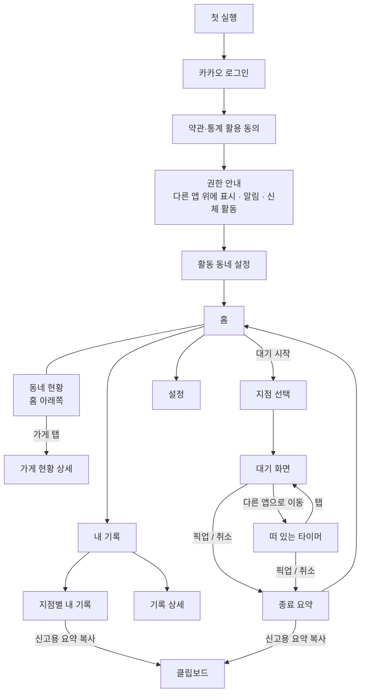

# 화면 흐름 (MVP)

> 상태: 초안 · 최종 수정 2026-09-27
> 기준: `기획-검토.md` 1-0 핵심 가치, 8장 MVP 범위, D8~D15. 안드로이드 앱.
> 클릭형 목업: https://claude.ai/artifact/VPKkZEJ3rioXYsU7xBMLnE
> 예시의 가게 이름은 모두 가상이다.

## 1. 설계 원칙

기획 8-1 원칙을 화면에 옮기면 다음과 같다.

| 원칙 | 화면 규칙 |
|---|---|
| 도착한 뒤에만 쓴다 | 모든 입력은 정차 상태를 전제. 그래도 버튼은 크게, 한 손 엄지 영역(화면 아래쪽)에 둔다 |
| 음식이 안 나와 있을 때만 쓴다 | 앱을 열면 첫 화면 한가운데가 **[대기 시작]**. 다른 기능은 그 아래로 |
| 기다리는 동안 방해하지 않는다 | 대기가 시작되면 앱은 **떠 있는 타이머**로 줄어든다. 음식이 나오면 타이머에서 한 번 탭으로 끝 |
| 기록이 곧 공유다 | [대기 시작]을 누르면 따로 조작 없이 동네 현황에 뜬다. 공유용 추가 입력은 없다 |
| 라이더가 아니라 가게를 보여준다 | 동네 현황은 가게 단위. 누가 기다리는지는 드러내지 않는다(D12) |
| 기록은 증거다 | 도착·픽업·취소 시각은 버튼을 누른 순간 찍히고 **나중에 고칠 수 없다.** 고칠 수 있는 것은 메모뿐 |
| 플랫폼 앱 정보는 받지 않는다 | 조리 예정 시각, 조리완료 알림, 플랫폼 이름을 입력하는 칸이 없다(D15). 기록은 라이더가 가게 앞에서 겪은 일뿐 |

## 2. 전체 지도



하단 탭은 **홈 · 내 기록 · 설정** 세 개. 대기 중에는 어느 탭에 있든 상단에 진행 중 대기 띠가 붙는다.

## 3. 첫 실행 (한 번만)

### 3-1. 카카오 로그인
- 버튼 하나. 받는 정보는 회원번호뿐(D10)이라는 안내 한 줄.

### 3-2. 약관·통계 활용 동의
- 필수: 이용약관, 개인정보 처리방침.
- 필수: **"기록은 개인을 알아볼 수 없는 형태로 지점별 통계에 쓰일 수 있습니다."** (8-6-2, 3단계 대비)
- 문구는 개발 중 법률 검토와 함께 확정.

### 3-3. 권한 안내
| 권한 | 왜 필요한가 (화면 문구) | 거부하면 |
|---|---|---|
| 다른 앱 위에 표시 | "유튜브·웹툰을 보면서도 대기 시간을 보고 바로 [픽업]을 누를 수 있어요" | 떠 있는 타이머 없이 **상단 알림**으로만 동작 |
| 알림 | "대기 타이머를 알림창에 띄워요" | 앱 안에서만 동작. 대기 판단 도우미 안내를 놓칠 수 있음 |
| 신체 활동 | "출발하면 알아서 픽업을 마무리해요. 위치(GPS)는 쓰지 않아요" | 움직임 감지 없이 동작. [픽업]을 잊으면 60분 확인 알림으로만 마무리(D14) |

- 권한은 설정 화면으로 넘어갔다 돌아와야 하므로, 한 번에 하나씩 안내한다.
- 둘 다 거부해도 앱은 쓸 수 있게 한다.

### 3-4. 활동 구역 설정
- 동 이름으로 고른다. 최대 3개. GPS는 쓰지 않는다(D11).
- 쓰임: ① 장소 검색 정렬 기준 ② **동네 현황에 보여줄 범위**(D12). 내 현재 위치 반경이 아니라 내가 고른 구역이다.

## 4. 대기 한 건 (핵심 흐름)

### 4-1. 홈

```
┌─────────────────────────┐
│ 어미새            ⚙      │
│                         │
│                         │
│   ┌─────────────────┐   │
│   │                 │   │
│   │   대기 시작      │   │  ← 화면 가운데, 가장 큰 버튼
│   │                 │   │
│   └─────────────────┘   │
│   음식이 안 나와 있을 때  │
│                         │
│ 지금 밀린 가게 · ○○동  18:43│
│ 바삭치킨 ○○점  2명  +12분  │
│ 돈까스공방 △△점 1명  +4분  │
│                         │
│ 최근 내 기록 >            │
│ [홈]   [내 기록]  [설정] │
└─────────────────────────┘
```

- **[대기 시작]을 누른 순간이 도착 시각**이다. 지점을 고르는 데 걸린 시간은 대기에 포함되지 않게 먼저 찍는다.
- 이미 진행 중인 대기가 있으면 [대기 시작] 대신 진행 중 대기 카드가 뜬다. MVP는 **동시에 한 건만** 기록한다.
- 탈것으로 이동 중이면 [대기 시작]을 눌러도 "이동 중에는 대기를 시작할 수 없어요"가 뜬다(D14).
- 홈 아래쪽은 **지금 밀린 가게**(동네 현황, 4-7). 콜을 기다리는 동안 앱을 열면 바로 보이게 홈에 둔다.

### 4-2. 지점 선택

```
┌─────────────────────────┐
│ ← 어느 가게인가요?        │
│ 도착 18:31 기록됨         │
│                         │
│ 최근 간 곳               │
│ ▸ 바삭치킨 ○○점          │
│ ▸ 홍반장 반점 △△점        │
│ ▸ 명동칼국수 □□점         │
│                         │
│ 🔍 가게 이름 검색         │
└─────────────────────────┘
```

- 최근 간 곳: 최근 방문 순 5곳. **한 번 탭하면 바로 대기 화면**으로 간다. 입력은 이것으로 끝이다.
- 검색: 카카오 키워드 검색, 음식점·카페 카테고리 우선, 활동 동네 기준 정렬(D11).
- 검색 결과가 없으면 맨 아래 **[직접 추가]** → 이름·주소 입력 → "미확인 지점".
- 플랫폼(배민/쿠팡이츠) 선택과 조리 예정 시각 입력은 **없다**(D15).

### 4-3. 대기 화면 (앱 안)

```
┌─────────────────────────┐
│ 바삭치킨 ○○점             │
│                         │
│    대기 11분             │  ← 가장 큰 글자
│    도착 18:31            │
│                         │
│ 알림 [15분][20분][25분][끄기]│
│ [메모]                   │
│                         │
│ ┌──────────┐┌────────┐  │
│ │   픽업    ││  취소  │  │
│ └──────────┘└────────┘  │
└─────────────────────────┘
```

**타이머 색 (대기 시간 기준, 동네 현황과 같은 기준)**

| 대기 | 색 |
|---|---|
| 10분 미만 | 회색 |
| 10~19분 | 주황 |
| 20분 이상 | 진한 빨강 |

**대기 알림**
- 라이더가 정하는 **개인 알람**이다. 예: 쿠팡이츠에 "10분 뒤 조리완료 예정"(배민은 "준비완료 예정시간")이 떠 있었고 지원금 기준이 예정 +15분이라면, 라이더가 머릿속으로 계산해 [25분]을 누른다. 앱은 그 계산의 근거(예정 시각)를 받지 않는다(D15).
- 정한 시간이 되면 떠 있는 타이머가 깜빡이고 진동 1회, "정한 25분이 됐어요".
- 마지막으로 고른 알림 시간을 기억한다.
- "취소하세요" 같은 권유 문구는 쓰지 않는다.

**보조**
- [메모]: 한 줄. 예: "완료 눌렀다는데 음식 없음".
- 화면 아래에 작게: "이 대기는 동네 라이더들에게 가게 단위로 보이고 있어요".

### 4-4. 떠 있는 타이머

접힌 상태(기본): 화면 가장자리에 작은 알약 모양. 드래그로 위치 이동.

```
      ┌──────────┐
      │ ● 11분    │   ← 대기 시간 색
      └──────────┘
```

탭하면 펼친 상태:

```
┌──────────────────────┐
│ 바삭치킨 ○○점  대기 11분 │
│ [픽업]  [취소]  [열기]  │
└──────────────────────┘
```

- 펼친 상태는 5초 동안 아무것도 안 누르면 다시 접힌다.
- 영상 가림을 줄이려고 접힌 상태는 최소 크기로. 아래로 끌어 내리면 숨김(알림창에는 계속 남음).
- **상단 알림**에도 같은 내용과 [픽업]·[취소] 버튼을 둔다. 떠 있는 타이머 권한이 없으면 이것만 쓴다.

### 4-5. 픽업·취소 누를 때

| 동작 | 처리 | 이유 |
|---|---|---|
| [픽업] | 한 번 탭으로 즉시 기록. 5초간 "되돌리기" 띄움 | 음식 받는 순간 손이 바쁘다. 확인 창은 방해 |
| [취소] | "콜을 취소했나요?" 확인 한 번 | 잘못 누르면 가장 강한 신호(취소)가 오염된다 |

- **출발 감지(D14):** 탈것 이동이 1분 넘게 이어지면 그 시각을 출발 시각으로 저장하고, "출발하셨나요? 픽업으로 기록할게요 [맞아요] [아니요]"를 띄운다. 답이 없으면 픽업으로 마무리한다. 픽업 시각은 **출발 시각과 [픽업] 중 이른 쪽**.
- 시각은 서버 시각으로 찍는다. 네트워크가 없으면 기기 시각으로 저장하고 나중에 올리며, 기록에 "기기 시각"이라고 표시한다.

### 4-6. 종료 요약

```
┌─────────────────────────┐
│ 바삭치킨 ○○점            │
│                         │
│   대기 21분              │
│   취소 18:52             │
│                         │
│ 이 기록을 동네 라이더 5명이 봤어요 │
│ 이 지점 내 기록: 5번째     │
│ 평균 대기 16분            │
│                         │
│ [메모 남기기]             │
│ [신고용 요약 복사]         │
│                         │
│        닫기              │
└─────────────────────────┘
```

- 떠 있는 타이머에서 끝낸 경우 이 화면을 띄우지 않고 **알림 한 줄**("바삭치킨 ○○점 대기 21분 기록됨")만 보낸다. 보던 영상을 끊지 않기 위해서다. 알림을 누르면 이 화면이 열린다.

### 4-7. 동네 현황 (지금 밀린 가게)

홈 아래쪽 목록. 내가 고른 구역 안에서 **지금 진행 중인 대기**가 있는 가게만 보인다(D12).

| 보는 사람 | 한 줄에 보이는 것 |
|---|---|
| 최근 7일 안에 기록함, 또는 가입 2주 이내 | 바삭치킨 ○○점 · **2명 대기 중 · 가장 긴 대기 18분째** · 18:43 기준 |
| 최근 7일 기록 없음 (가입 2주 이후) | 바삭치킨 ○○점 · **밀림** + "기록을 남기면 자세히 볼 수 있어요" |

- 정렬: 가장 긴 대기 순. 색은 4-3의 대기 시간 기준.
- 한 명의 기록부터 보여준다. 인원은 그대로 적는다("1명 대기 중").
- 대기가 끝나면 바로 빠진다. 5분 넘게 갱신이 없으면(앱 꺼짐 등) 흐리게 표시하고, 60분이 지나면 뺀다.
- **누가** 기다리는지, 어느 플랫폼 주문인지는 어디에도 보이지 않는다.
- 가게를 누르면 **가게 현황 상세**: 지금 대기 인원과 각 대기의 경과 시간, 그리고 MVP 기간에는 테스트 그룹의 최근 2주 기록 요약(건수, 평균 대기). 3단계 전까지는 테스트 그룹 안에서만.
- "거르자" 같은 판단 문구는 쓰지 않는다. 사실만 보여주고 판단은 라이더가 한다(D4).

**내 기록의 쓰임 알림 (D13):** 대기가 끝난 뒤 "이 기록을 동네 라이더 N명이 봤어요". 종료 요약과 하루 마감 알림에 표시.

## 5. 내 기록

### 5-1. 기록 목록
- 날짜별 목록. 한 줄: 지점 · 대기 시간 · 결과(픽업/취소) · 신고함 · 출발 감지 표시.
- 상단 필터: 기간(이번 주 / 이번 달 / 전체), 결과(취소만).
- 지점 이름을 누르면 지점별 내 기록으로.

### 5-2. 기록 상세
- 시간순 기록: 도착 → (출발 감지) → 픽업/취소.
- 고칠 수 있는 것: 메모.
- 고칠 수 없는 것: 도착·출발·픽업·취소 시각.
- [신고용 요약 복사], [신고함 표시].
- [삭제]: 가능하되, 3단계 집계에서도 빠진다는 안내.

### 5-3. 지점별 내 기록
```
┌─────────────────────────┐
│ ← 바삭치킨 ○○점           │
│                         │
│ 내가 기다린 횟수   5번     │
│ 평균 대기         16분     │
│ 가장 길었던 대기   24분    │
│ 취소              2번     │
│                         │
│ 9/27 21분 취소  ☑신고함    │
│ 9/24 24분 취소            │
│ 9/20 9분 픽업             │
│ ...                     │
│                         │
│ [이 지점 요약 복사]        │
└─────────────────────────┘
```

- 숫자는 **내 기록만**. 다른 라이더 기록은 가게 현황 상세에서만 본다(D8).
- "기다린 횟수"는 대기가 생긴 횟수다. 음식이 바로 나온 방문은 기록하지 않으므로 방문 대비 비율은 없다(기획 8-1-1).

### 5-4. 신고용 요약 형식

한 건:

```
[조리 지연 제보]
가게: 바삭치킨 ○○점 (서울 ○○구 ○○로 12)
도착: 2026-09-27 18:31
결과: 18:52 콜 취소 (가게 앞 대기 21분)
조리(준비)완료 예정 시각: ______ (배민 "준비완료 예정시간" / 쿠팡이츠 "조리완료 예정"을 확인해 적어 주세요)
메모: 완료 눌렀다는데 음식 없음
```

지점 누적:

```
[조리 지연 반복 제보]
가게: 바삭치킨 ○○점 (서울 ○○구 ○○로 12)
기간: 2026-09-01 ~ 2026-09-27
본인 대기 5건 / 평균 대기 16분 / 최대 24분 / 취소 2건
- 09-27 도착 18:31 → 취소 18:52 (21분)
- 09-24 도착 19:04 → 취소 19:28 (24분)
- ...
```

- **본인 기록만** 쓴다. 조리 예정 시각은 앱이 채우지 않고 빈칸으로 둔다. 라이더가 신고할 때 플랫폼 앱을 보고 직접 적는다(D15, 기획 9-2).
- 배민 제보센터 조건(예정 시각이 지난 뒤의 대기)에 맞는 건인지는 라이더가 판단한다.
- 복사 뒤 "제보센터 열기" 링크를 함께 보여준다.

## 6. 설정
- 활동 동네 변경
- 권한 상태(다른 앱 위에 표시, 알림)와 바로가기
- 떠 있는 타이머 크기·투명도
- 로그아웃, 탈퇴(기록 전체 삭제)

## 7. 예외 상황

| 상황 | 처리 |
|---|---|
| 대기 중 앱이 꺼지거나 폰이 재시작됨 | 시각은 이미 서버에 있다. 앱을 다시 열면 진행 중 대기와 떠 있는 타이머를 복구 |
| [픽업]을 잊음 | 대기 60분이 지나면 알림으로 "아직 기다리는 중인가요?" [픽업함] [취소함] [아직]. 120분이 지나면 "미완료"로 닫고 대기 통계에서 뺀다 |
| 같은 가게 주문 두 건 | 한 건으로 기록하고 메모로 남긴다. MVP는 동시 한 건만 |
| 대기 중 다른 가게 콜로 이동 | 현재 대기를 [취소] 또는 [픽업]으로 끝내야 새 대기를 시작할 수 있다 |
| 검색에 가게가 없음 | 직접 추가 → 미확인 지점 |
| 네트워크 없음 | 기기에 저장 후 동기화, "기기 시각" 표시. 동네 현황에는 연결될 때까지 안 보임 |
| 이동 중 [대기 시작] | "이동 중에는 대기를 시작할 수 없어요". 감지가 틀렸다면 [정차 중이에요]로 시작 가능하되 기록에 표시가 남는다 |
| 움직임 감지 실패 (출발했는데 못 잡음) | 기존대로 [픽업] 또는 60분 확인 알림 |
| 다른 앱 위에 표시 권한 없음 | 상단 알림만으로 동작 |

## 8. 정할 것

1. **앱 이름.** 화면 예시의 "어미새"는 저장소 이름(eomisae)을 임시로 쓴 것이다(기획 열린 질문 5).
2. **대기 알림 선택지.** 초안은 15·20·25분. 라이더가 실제로 많이 쓸 값은?
2-1. **대기 시간 색 기준.** 초안은 10분·20분.
3. **[픽업] 되돌리기 시간.** 초안은 5초.
4. **미완료 처리 시간.** 초안은 60분에 확인 알림, 120분에 자동 종료.
5. **동네 현황에서 흐리게 표시하는 기준.** 초안은 5분 무갱신이면 흐리게, 60분이면 제외.
